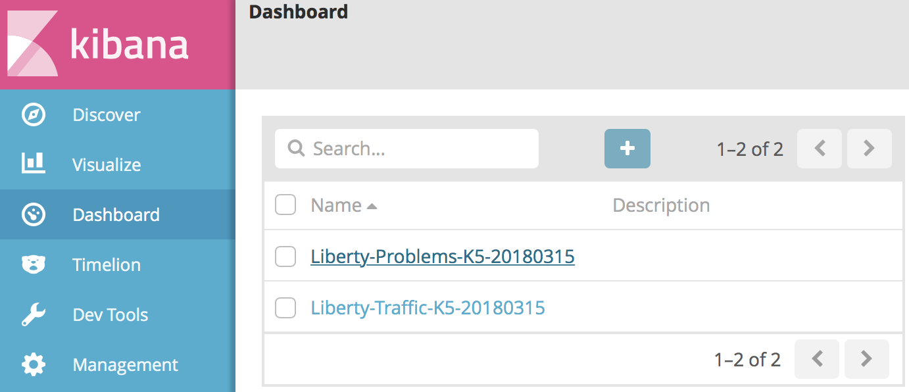
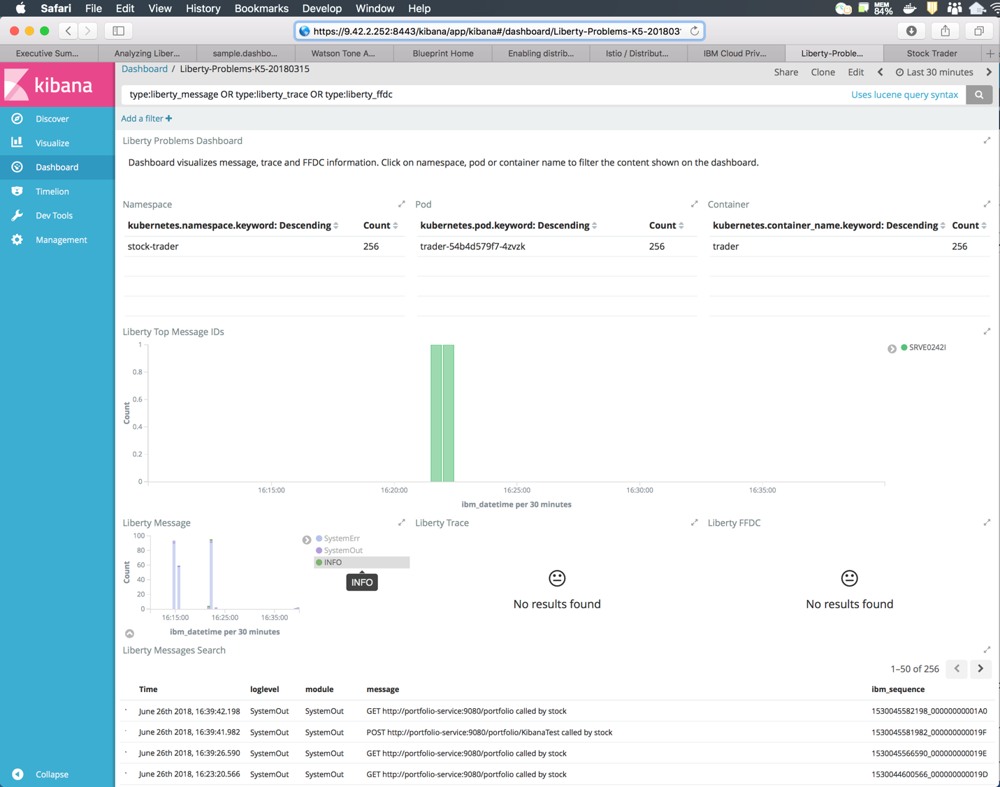

---

copyright:
  years: 2019
lastupdated: "2019-06-07"

keywords: java logging, log level java, debug java, json log java, json log help, kibana liberty, liberty messages

subcollection: java

---

{:new_window: target="_blank"}
{:shortdesc: .shortdesc}
{:screen: .screen}
{:codeblock: .codeblock}
{:pre: .pre}
{:tip: .tip}
{:note: .note}
{:important: .important}

# Logging
{: #mp-logging}

The recommended approach for logging with MicroProfile applications is to use the Java&trade; JSR-47 logging standard. You can begin with the following imports:

```java
import java.util.logging.Level;
import java.util.logging.Logger;
```
{: codeblock}

Second, instantiate an instance of a logger at the class level:

```java
private static Logger logger = Logger.getLogger(PortfolioService.class.getName());
```
{: codeblock}

Add calls to the `logger` instance before, after, and within the operations in your code. The methods of the `Logger` interface are themselves named to indicate the importance, or "level", of the information that is being logged.

```java
logger.info("Creating portfolio for "+owner);
logger.warning("Unable to send message to JMS provider. Continuing without notification of change in loyalty level.");
```
{: codeblock}

The log level is displayed when these messages are output to the console.

```
[INFO] Creating portfolio for John

[WARNING] Unable to send message to JMS provider. Continuing without notification of change in loyalty level.
```
{: screen}

Log levels give you the flexibility to dynamically choose which logs your application writes. This feature enables you to write log code that describes both high-level application state and detailed debug content up front. So you can filter out the more verbose debug content until it is needed. The log level `info` is typically the minimum output level, followed by `fine`, `finer`, `finest`, and `debug`.

If a log entry requires multiple lines of code, or involves expensive operations such as string concatenation, consider guarding them with a test to determine whether the log level is enabled. Adding the check ensures that your application doesn't spend crucial time building log messages that end up being filtered out. In the following example, the intended log level of `fine` is enabled before it attempts to build the message output.

```java
if (logger.isLoggable(Level.FINE)) {
    StringWriter writer = new StringWriter();
    exception.printStackTrace(new PrintWriter(writer));
    logger.fine(writer.toString());
}
```
{: codeblock}

For more information about log levels, and configuration details, see [WebSphere Liberty troubleshooting guide](https://www.ibm.com/support/knowledgecenter/SSEQTP_liberty/com.ibm.websphere.wlp.doc/ae/rwlp_logging.html){: new_window}  and the [java.util.logging API documentation](https://docs.oracle.com/javase/8/docs/api/java/util/logging/package-summary.html){: new_window} .

## JSON logging with Liberty
{: #mp-json-logging}

Liberty supports JSON-formatted logging. When enabled, log messages are written to the console in JSON format. Enable this using the following logging stanza in your `server.xml`:

```xml
<logging consoleLogLevel="INFO" consoleFormat="json" consoleSource="message,trace,accessLog,ffdc" />
```
{: codeblock}

Even though `accessLog` is included in the list of console sources, HTTP access logging must be enabled before those logs are written to the console. The following snippet shows how to add the `accessLogging` subelement to the `httpEndpoint` element in your `server.xml`:

```xml
<httpEndpoint id="defaultHttpEndpoint" host="\*" httpPort="9080" httpsPort="9443">
  <accessLogging
    filepath="${server.output.dir}/logs/http_defaultEndpoint_access.log"
    logFormat='%h %u %t "%r" %s %b %D %{User-agent}i'>
  </accessLogging>
</httpEndpoint>
```
{: codeblock}

Now when you add this code to your application:

```java
if (logger.isLoggable(Level.AUDIT)) {
    logger.audit("Initialization complete");
}
```

You can see the following output in the logs:

```json
{ "type":"liberty_message",
  "host":"trader-54b4d579f7-4zvzk",
  "ibm_userDir":"\/opt\/ol\/wlp\/usr\/",
  "ibm_serverName":"defaultServer",
  "ibm_datetime":"2018-06-21T19:23:21.356+0000",
  "ibm_threadId":"00000028",
  "module":"com.trader.Main",
  "loglevel":"AUDIT",
  "message":"Initialization complete"}
```
{: codeblock}

### Reading JSON log output
{: #mp-json-log-output}

The full JSON output is helpful for log storage and searches, but not as easy to read. You can examine the contents of the log in a terminal window by using the `kubectl` command. Fortunately there's a command-line tool that is named `jq` to help.

With the `jq` command, you can filter down and focus on the field or fields that you need. If you want to see the `message` field and filter everything else out, see the following example:

```
kubectl logs trader-54b4d579f7-4zvzk -n stock-trader -c trader | grep message | jq .message -r
```
{: pre}

Liberty has a few primitive console messages that are not JSON formatted. You can use the `grep` command to ensure that `jq` specifically parse lines that contain a message field.

## Additional features
{: #mp-log-features}

Guidelines for using log levels, like when to use `logger.info` or `logger.fine`, is something that each organization or project must decide on. In general, these interfaces are necessary and useful in almost any project.

One best practice is to use environment variables (fed to the pod through Kubernetes config maps or secrets) in each relevant field in the `server.xml` file. By using this method, you can change the logging configuration without needing to rebuild and redeploy your Docker image.

For example, to use environment variables to set fine grained logging attributes, you would change the stanza from the previous example:

```xml
<logging consoleLogLevel="INFO" consoleFormat="json" consoleSource="message,trace,accessLog,ffdc" />
```
{: codeblock}

To the following entry:

```xml
<logging consoleLogLevel="${env.LOG_LEVEL}" consoleFormat="${env.LOG_FORMAT}" consoleSource="${env.LOG_SOURCE}" />
```
{: codeblock}

Another alternative is to use the `WLP_LOGGING_CONSOLE_FORMAT` environment variable, as described in [Logging and Trace documentation](https://www.ibm.com/support/knowledgecenter/SSEQTP_liberty/com.ibm.websphere.wlp.doc/ae/rwlp_logging.html){: new_window} . This method is similar to the previous example, and you can set the `WLP_LOGGING_CONSOLE_FORMAT` variable to either `basic` (the default) or `json`.

## Kibana dashboards for Liberty
{: #liberty-kibana}

Along with the new JSON logging feature, Liberty provides pre-built Kibana dashboards [that you can download from GitHub](https://www.ibm.com/support/knowledgecenter/en/SSEQTP_liberty/com.ibm.websphere.wlp.doc/ae/twlp_icp_json_logging.html){: new_window} . Follow the instructions at the link to install them. Two new dashboards are now available:

{: caption="Figure 1. Kibana dashboards" caption-side="bottom"}

When you select the dashboard for problem determination, you can see:

{: caption="Figure 2. Kibana dashboard details" caption-side="bottom"}

The dashboard is interactive. For example, if you choose **INFO** in the legend for the **Liberty Message** widget, the **Liberty Messages Search** widget filters itself to just the `loglevel=INFO` messages. The dashboard federates log data from all of your Liberty-based microservices, filtering out other system logs.

There are more Kibana and Grafana dashboards that are associated with the Liberty helm chart. They are available as [extensions to the Liberty cloud pak](https://github.com/IBM/charts/tree/master/stable/ibm-websphere-liberty/ibm_cloud_pak/pak_extensions/dashboards){: new_window} .

## Next Steps
{: #mp-logging-next-steps notoc}

For more information about customizing log messages with appenders, log levels, and configuration details, see the official [Spring Boot reference for logging](https://docs.spring.io/spring-boot/docs/current/reference/html/howto-logging.html){: new_window} .

Learn more about viewing the logs in each of the following deployment environments:

* [Kubernetes Logs](https://kubernetes.io/docs/concepts/cluster-administration/logging/){: new_window} 
* [{{site.data.keyword.openwhisk}} Logs & Monitoring](/docs/openwhisk?topic=cloud-functions-logs)
* [{{site.data.keyword.cloud_notm}} Log Analysis](/docs/services/CloudLogAnalysis?topic=cloudloganalysis-log_analysis_ov#log_analysis_ov)
* [{{site.data.keyword.cloud_notm}} Private ELK stack](https://www.ibm.com/support/knowledgecenter/en/SSBS6K_2.1.0.2/manage_metrics/logging_elk.html){: new_window} 
