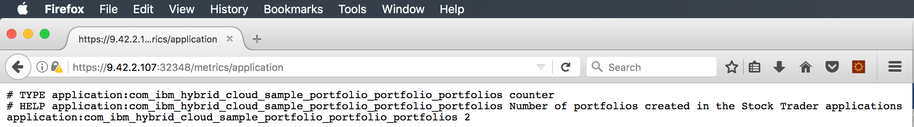

---

copyright:
  years: 2019
lastupdated: "2019-06-10"

keywords: mpmetrics microprofile, mpmetrics, prometheus java, metrics java, microprofile metrics

subcollection: java

---

{:shortdesc: .shortdesc}
{:screen: .screen}
{:codeblock: .codeblock}
{:pre: .pre}
{:tip: .tip}
{:note: .note}
{:important: .important}

# Metrics with MicroProfile
{: #mp-metrics}

MicroProfile provides a Metrics capability for adding custom metrics to your application by using simple annotations. To enable this feature, add the `mpMetrics-1.1` feature to your `server.xml`. You can optionally add the `monitor-1.0` feature if you'd like to see more app server-specific metrics (like about JDBC connection pools, for example).

Import the `@Counted` annotation to create a simple counter:

```java
import org.eclipse.microprofile.metrics.annotation.Counted;
```
{: codeblock}

Then, use the `@Counted` annotation to create a simple counter, as shown in the following example that counts how many times the `createPortfoloio` method is called: 

```java
@POST
@Path("/{owner}")
@Produces("application/json")
@Counted(monotonic=true, name="portfolios", displayName="Stock Trader portfolios", description="Number of portfolios created in the Stock Trader applications")
@RolesAllowed({"StockTrader"})
public JsonObject createPortfolio(@PathParam("owner") String owner) throws SQLException {
```
{: codeblock}

To build this code, add the following stanza to Maven's `pom.xml` file:

```xml
<dependency>
  <groupId>org.eclipse.microprofile</groupId>
  <artifactId>microprofile</artifactId>
  <version>2.0.1</version>
  <type>pom</type>
  <scope>provided</scope>
</dependency>
```
{: codeblock}

With that in place, the counter is incremented every time the `createPortfolio` JAX-RS method is called. 

You can invoke the `GET /metrics` URI to see both JVM (class loading, heap, and garbage collection statistics) and application-defined metrics. The `GET /metrics/application` URI returns application-defined metrics only. 

You can access the REST GET API through the curl CLI by using the assigned port (32388 in this example):

```
Johns-MacBook-Pro-8:StockTrader jalcorn$ curl http://9.42.2.107:32388/metrics/application

# TYPE application:com_ibm_hybrid_cloud_sample_portfolio_portfolio_portfolios counter

# HELP application:com_ibm_hybrid_cloud_sample_portfolio_portfolio_portfolios Number of portfolios created in the Stock Trader applications

application:com_ibm_hybrid_cloud_sample_portfolio_portfolio_portfolios

Johns-MacBook-Pro-8:StockTrader jalcorn$
```
{: screen}

As you can see, two portfolios are counted as expected. 

A few things of note:
- An in-memory counter is used: If the pod is restarted, the value is reset to zero; if there are multiple replicas, each has its own unique value.
- The "# HELP" text is what is specified as the description in the `@Counted` annotation.

You can view the output of this REST GET endpoint in your web browser as well:

{: caption="Figure 1. REST GET endpoint web browser" caption-side="bottom"}

By default, the `/metrics` endpoint requires https and login credentials be passed. Liberty 18.0.0.3 introduced the following stanza that you can put in your `server.xml` to define this endpoint to allow http and to be unauthenticated:

```xml
<mpMetrics authentication="false"/>
```

The Prometheus scraper configuration is simplified to make accessing the endpoint easier.
