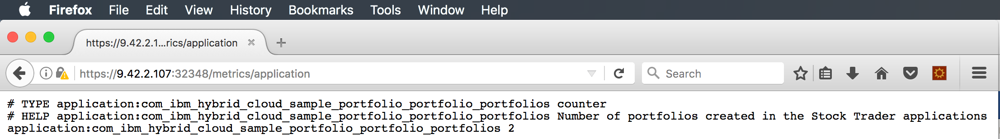

---

copyright:
  years: 2019
lastupdated: "2019-06-10"

keywords: mpmetrics microprofile, mpmetrics, prometheus java, metrics java, microprofile metrics

subcollection: java

---

{:new_window: target="_blank"}
{:shortdesc: .shortdesc}
{:screen: .screen}
{:codeblock: .codeblock}
{:pre: .pre}
{:tip: .tip}
{:note: .note}
{:important: .important}

# Metriken mit MicroProfile
{: #mp-metrics}

MicroProfile bietet eine Metrikfunktion zum Hinzufügen benutzerdefinierter Metriken zu Ihrer Anwendung, indem einfache Annotationen verwendet werden. Fügen Sie einfach das Feature `mpMetrics-1.1` zur Datei `server.xml` hinzu, um dieses Feature zu aktivieren. Wenn Sie weitere Metriken verwenden möchten, die speziell auf den App-Server zugeschnitten sind (z. B. JDBC-Verbindungspools), können Sie auch optional das Feature `monitor-1.0` hinzufügen.

Importieren Sie die Annotation `@Counted`, um einen einfachen Zähler zu erstellen:

```java
import org.eclipse.microprofile.metrics.annotation.Counted;
```
{: codeblock}

Verwenden Sie anschließend die Annotation `@Counted`, um einen einfachen Zähler zu erstellen, wie im folgenden Beispiel gezeigt wird. Dieser zählt, wie häufig die Methode `createPortfoloio` aufgerufen wird: 

```java
@POST
@Path("/{owner}")
@Produces("application/json")
@Counted(monotonic=true, name="portfolios", displayName="Stock Trader portfolios", description="Number of portfolios created in the Stock Trader applications")
@RolesAllowed({"StockTrader"})
public JsonObject createPortfolio(@PathParam("owner") String owner) throws SQLException {
```
{: codeblock}

Um diesen Code zu erstellen, müssen Sie der Maven-Datei `pom.xml` die folgende Zeilengruppe hinzufügen:

```xml
<dependency>
  <groupId>org.eclipse.microprofile</groupId>
  <artifactId>microprofile</artifactId>
  <version>2.0.1</version>
  <type>pom</type>
  <scope>provided</scope>
</dependency>
```
{: codeblock}

Wenn die JAX-RS-Methode 'createPortfolio' aufgerufen wird, wird der Zähler bei jedem Aufruf erhöht. 

Sie können den URI `GET /metrics` aufrufen, um sowohl die durch die JVM (Laden von Klassen, Heapspeicher und Garbage-Collection-Statistik) und die Anwendung definierten Metriken anzuzeigen. Der URI `GET /metrics/application` gibt nur anwendungsdefinierte Metriken zurück. 

Auf diese REST-GET-API kann über die curl-CLI unter Verwendung des zugeordneten Ports (in diesem Beispiel 32388) aufgerufen werden:

```
Johns-MacBook-Pro-8:StockTrader jalcorn$ curl http://9.42.2.107:32388/metrics/application

# TYPE application:com_ibm_hybrid_cloud_sample_portfolio_portfolio_portfolios Zähler

# HELP application:com_ibm_hybrid_cloud_sample_portfolio_portfolio_portfolios Die Anzahl der in der Anwendung "Stock Trader" erstellten Portfolios

application:com_ibm_hybrid_cloud_sample_portfolio_portfolio_portfolios

Johns-MacBook-Pro-8:StockTrader jalcorn$
```
{: screen}

Wie Sie sehen, werden zwei Portfolios wie erwartet gezählt. 

Dabei sind einige Dinge zu berücksichtigen:
- Ein speicherinterner Zähler wird verwendet: Wenn der Pod erneut gestartet wird, wird der Wert auf null zurückgesetzt. Wenn mehrere Replikate vorhanden sind, weist jedes Replikat seinen eigenen eindeutigen Wert auf. 
- Der Text "# HELP" ist das, was als Beschreibung in der Annotation `@Counted` angegeben wurde.

Sie können die Ausgabe dieses REST-GET-Endpunkts auch in Ihrem Web-Browser anzeigen:



Beachten Sie, dass der Endpunkt `/metrics` standardmäßig die Weitergabe von HTTPS- und Anmeldeberechtigungsnachweisen erfordert. In Liberty 18.0.0.3 wurde die folgende Zeilengruppe eingeführt, die Sie in die Datei `server.xml` einfügen können, um anzugeben, dass dieser Endpunkt HTTP zulassen und nicht authentifiziert werden soll:

```xml
<mpMetrics authentication="false"/>
```

Die Prometheus-Schaberkonfiguration wird vereinfacht, um den Zugriff auf den Endpunkt zu erleichtern.
