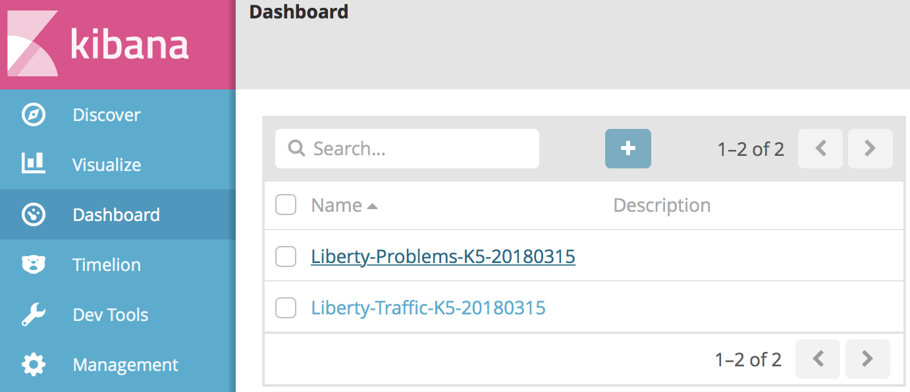

---

copyright:
  years: 2019
lastupdated: "2019-04-04"

keywords: java logging, log level java, debug java, json log java, json log help, kibana liberty, liberty messages

subcollection: java

---

{:new_window: target="_blank"}
{:shortdesc: .shortdesc}
{:screen: .screen}
{:codeblock: .codeblock}
{:pre: .pre}
{:tip: .tip}
{:note: .note}
{:important: .important}

# Registro
{: #mp-logging}

El enfoque recomendado para el registro con aplicaciones de MicroProfile es el estándar de registro JSR-47 de Java. Empiece por las importaciones siguientes:

```java
import java.util.logging.Level;
import java.util.logging.Logger;
```
{: codeblock}

En segundo lugar, cree una instancia de un registrador a nivel de clase:

```java
private static Logger logger = Logger.getLogger(PortfolioService.class.getName());
```
{: codeblock}

Añada llamadas a la instancia de `logger` antes, después, y durante las operaciones del código. Los métodos de la interfaz `Logger` se denominan por sí mismos para indicar la importancia, o "nivel", de la información que se registra.

```java
logger.info("Creating portfolio for "+owner);
logger.warning("Unable to send message to JMS provider. Continuing without notification of change in loyalty level.");
```
{: codeblock}

El nivel de registro se visualiza cuando estos mensajes se producen en la consola.

```
[INFO] Creating portfolio for John

[WARNING] Unable to send message to JMS provider. Continuing without notification of change in loyalty level.
```
{: screen}

Los niveles de registro le proporcionan la flexibilidad necesaria para elegir dinámicamente qué registros escribirá la aplicación. Esto le permite escribir código de registro que describe tanto el estado de aplicación de alto nivel como el contenido de depuración detallado por adelantado, pero filtra el contenido de depuración más detallado hasta que lo necesite. El nivel de registro `info` es normalmente el nivel de salida mínimo, seguido por `fine`, `finer`, `finest` y `debug`.

Cuando las entradas de registro requieren varias líneas de código, o implican operaciones costosas como, por ejemplo, concatenación de series, debe considerar protegerlas con una prueba para determinar si el nivel de registro está habilitado. De esta forma, garantizará que su aplicación no dedique un tiempo crucial a crear mensajes de registro que acabarán siendo filtrados. El ejemplo siguiente verifica que el nivel de registro previsto `fine` está habilitado antes de intentar generar la salida de mensaje.

```java
if (logger.isLoggable(Level.FINE)) {
    StringWriter writer = new StringWriter();
    exception.printStackTrace(new PrintWriter(writer));
    logger.fine(writer.toString());
}
```
{: codeblock}

Para obtener más información sobre los niveles de registro y los detalles de configuración, consulte la [Guía de resolución de problemas de WebSphere Liberty](https://www.ibm.com/support/knowledgecenter/SSEQTP_liberty/com.ibm.websphere.wlp.doc/ae/rwlp_logging.html){: new_window}  y la [documentación de la API java.util.logging](https://docs.oracle.com/javase/8/docs/api/java/util/logging/package-summary.html){: new_window} .

## Registro de JSON con Liberty
{: #mp-json-logging}

Liberty da soporte al registro con formato JSON. Cuando está habilitado, los mensajes de registro se grabarán en la consola en formato JSON. Habilite esta opción utilizando la stanza de registro siguiente en `server.xml`:

```xml
<logging consoleLogLevel="INFO" consoleFormat="json" consoleSource="message,trace,accessLog,ffdc" />
```
{: codeblock}

Tenga en cuenta que si `accessLog` se incluye en la lista anterior de orígenes de la consola, el registro de acceso HTTP debe estar habilitado antes de que dichos registros se graben en la consola. El siguiente fragmento de código muestra cómo añadir el subelemento `accessLogging` al elemento `httpEndpoint` en el archivo `server.xml`:

```xml
<httpEndpoint id="defaultHttpEndpoint" host="\*" httpPort="9080" httpsPort="9443">
  <accessLogging
    filepath="${server.output.dir}/logs/http_defaultEndpoint_access.log"
    logFormat='%h %u %t "%r" %s %b %D %{User-agent}i'>
  </accessLogging>
</httpEndpoint>
```
{: codeblock}

Ahora, cuando añada este código a la aplicación:

```java
if (logger.isLoggable(Level.AUDIT)) {
    logger.audit("Initialization complete");
}
```

encontrará algo como esto en los registros:

```json
{ "type":"liberty_message",
  "host":"trader-54b4d579f7-4zvzk",
  "ibm_userDir":"\/opt\/ol\/wlp\/usr\/",
  "ibm_serverName":"defaultServer",
  "ibm_datetime":"2018-06-21T19:23:21.356+0000",
  "ibm_threadId":"00000028",
  "module":"com.trader.Main",
  "loglevel":"AUDIT",
  "message":"Initialization complete"}
```
{: codeblock}

### Lectura de salida de registro JSON
{: #mp-json-log-output}

La salida JSON completa es muy útil para el almacenamiento de registros y las búsquedas, pero no tan fácil de leer. Es posible que tenga que examinar el contenido del registro en una ventana de terminal utilizando `kubectl`. Afortunadamente, hay una herramienta de línea de mandatos llamada `jq` como ayuda.

`jq` le permite filtrar y centrarse en el campo o los campos que necesita. Por ejemplo, si solo desea el campo `message` y filtra todo lo demás:

```
kubectl logs trader-54b4d579f7-4zvzk -n stock-trader -c trader | grep message | jq .message -r
```
{: pre}

Liberty tiene unos pocos mensajes de consola primitivos que no tienen formato JSON. Utilizar `grep` garantiza que `jq` solo analice las líneas que contengan un campo de mensaje.

## Características adicionales
{: #mp-log-features}

Las directrices para utilizar los niveles de registro, como cuándo utilizar `logger.info` o `logger.fine`, son algo que se debe decidir en cada organización o proyecto. Sin embargo, esperamos que estas interfaces sean necesarias y útiles en casi cualquier proyecto.

Una de las mejores prácticas es utilizar variables de entorno (suministradas al pod a través de secretos o correlaciones de configuración de Kube) en cada campo relevante en `server.xml`. De este modo, puede cambiar la configuración de registro sin necesidad de volver a crear y volver a desplegar la imagen de Docker.

Por ejemplo, para utilizar variables de entorno para establecer los atributos de registro detallados, puede cambiar la stanza del ejemplo anterior:

```xml
<logging consoleLogLevel="INFO" consoleFormat="json" consoleSource="message,trace,accessLog,ffdc" />
```
{: codeblock}

A algo más parecido a esto:

```xml
<logging consoleLogLevel="${env.LOG_LEVEL}" consoleFormat="${env.LOG_FORMAT}" consoleSource="${env.LOG_SOURCE}" />
```
{: codeblock}

Otra alternativa es utilizar la variable de entorno `WLP_LOGGING_CONSOLE_FORMAT`, tal como se describe en la [Documentación de registro y rastreo](https://www.ibm.com/support/knowledgecenter/SSEQTP_liberty/com.ibm.websphere.wlp.doc/ae/rwlp_logging.html){: new_window} . Es similar al ejemplo anterior: puede establecer la variable `WLP_LOGGING_CONSOLE_FORMAT` en `basic` (el valor predeterminado) o en `json`.

## Paneles de control de Kibana para Liberty
{: #liberty-kibana}

Junto con la nueva característica de registro de JSON, Liberty proporciona paneles de control de Kibana predefinidos [que puede descargar de GitHub](https://www.ibm.com/support/knowledgecenter/en/SSEQTP_liberty/com.ibm.websphere.wlp.doc/ae/twlp_icp_json_logging.html){: new_window} . Siga las instrucciones que aparecen en el enlace para instalarlos. Deben haber disponibles dos paneles de control nuevos:



Cuando pulsa en el panel de control para la determinación de problemas, ve lo siguiente:


El panel de control es interactivo. Por ejemplo, si pulsa **INFO** en la descripción del widget **Mensaje de Liberty**, el widget siguiente **Búsqueda de mensajes de Liberty** filtrará sólo los mensajes de `loglevel=INFO`. El panel de control federará los datos de registro de todos los microservicios basados en Liberty y filtrará los demás registros del sistema.

Hay paneles de control adicionales de Kibana y Grafana asociados con la gráfica de Helm de Liberty. Están disponibles como [extensiones del paquete de nube de Liberty](https://github.com/IBM/charts/tree/master/stable/ibm-websphere-liberty/ibm_cloud_pak/pak_extensions/dashboards){: new_window} .

## Pasos siguientes
{: #mp-logging-next-steps notoc}

Para obtener más información sobre la personalización de los mensajes de registro con agregadores, niveles de registro y detalles de configuración, consulte la [referencia de Spring Boot para el registro](https://docs.spring.io/spring-boot/docs/current/reference/html/howto-logging.html){: new_window} .

Obtenga más información sobre la visualización de los registros en cada uno de los entornos de despliegue:

* [Registros de Kubernetes](https://kubernetes.io/docs/concepts/cluster-administration/logging/){: new_window} 
* [Registros y supervisión de {{site.data.keyword.openwhisk}}](/docs/openwhisk?topic=cloud-functions-openwhisk_logs#openwhisk_logs)
* [{{site.data.keyword.cloud_notm}} Log Analysis](/docs/services/CloudLogAnalysis?topic=cloudloganalysis-log_analysis_ov#log_analysis_ov)
* [Pila de ELK de {{site.data.keyword.cloud_notm}} Private](https://www.ibm.com/support/knowledgecenter/en/SSBS6K_2.1.0.2/manage_metrics/logging_elk.html){: new_window} 
