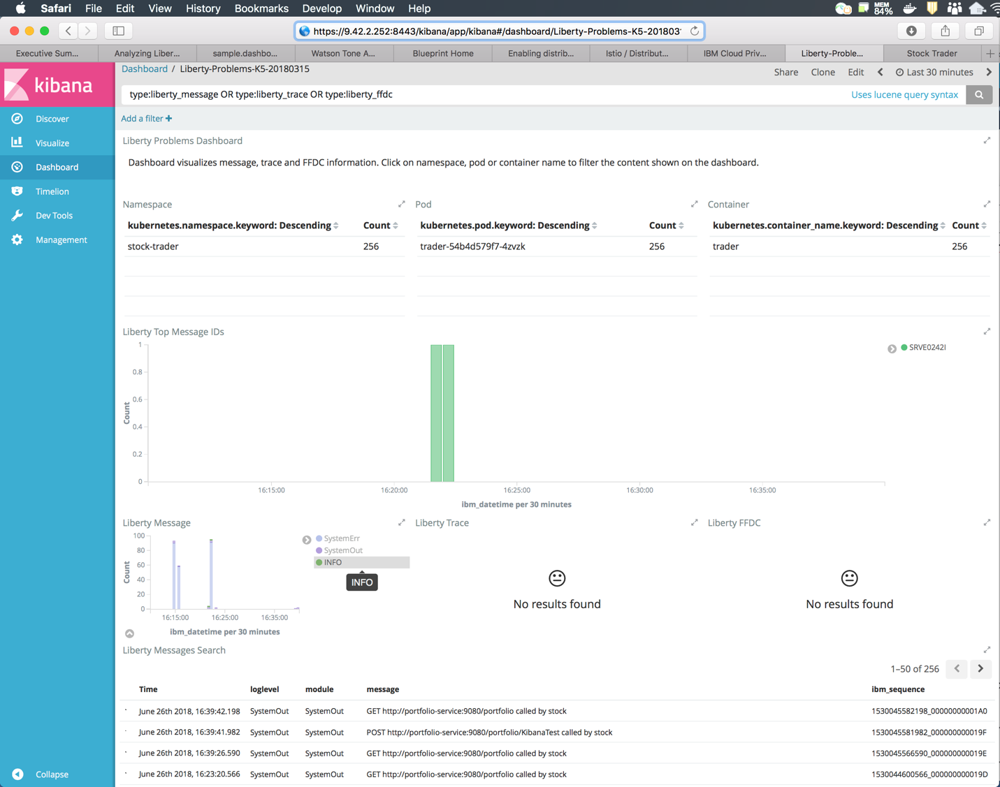

---

copyright:
  years: 2019
lastupdated: "2019-06-10"

keywords: java logging, log level java, debug java, json log java, json log help, kibana liberty, liberty messages

subcollection: java

---

{:new_window: target="_blank"}
{:shortdesc: .shortdesc}
{:screen: .screen}
{:codeblock: .codeblock}
{:pre: .pre}
{:tip: .tip}
{:note: .note}
{:important: .important}

# Consignation
{: #mp-logging}

L'approche recommandée pour la consignation avec les applications MicroProfile est la norme de consignation JSR-47 de Java. Vous pouvez commencer par les importations suivantes :

```java
import java.util.logging.Level;
import java.util.logging.Logger;
```
{: codeblock}

Ensuite, instanciez une instance d'un consignateur au niveau de la classe :

```java
private static Logger logger = Logger.getLogger(PortfolioService.class.getName());
```
{: codeblock}

Ajoutez des appels à l'instance `logger` avant, après et à l'intérieur des opérations dans votre code. Les méthodes de l'interface `Logger` sont elles-mêmes nommées pour indiquer l'importance, ou le "niveau" de l'information qui est consignée.

```java
logger.info("Creating portfolio for "+owner);
logger.warning("Unable to send message to JMS provider. Continuing without notification of change in loyalty level.");
```
{: codeblock}

Le niveau de consignation s'affiche lorsque ces messages sont écrits dans la console.

```
[INFO] Creating portfolio for John

[WARNING] Unable to send message to JMS provider. Continuing without notification of change in loyalty level.
```
{: screen}

Les niveaux de consignation vous donnent la flexibilité de choisir dynamiquement les journaux dans lesquels votre application écrit. L'utilisation de niveaux de journalisation permet d'écrire du code de journal qui décrit à la fois un état d'application de haut niveau et des contenus de débogage détaillés en premier. Par conséquent, vous pouvez filtrer les contenus de débogage plus verbeux jusqu'à ce que vous en ayez besoin. Le niveau de consignation `info` est généralement le niveau de sortie minimum, suivi de `fine`, `finer`, `finest` et `debug`.

Lorsqu'une entrée de journal nécessite plusieurs lignes de code ou implique des opérations coûteuses telles que la concaténation de chaînes, vous devriez envisager de les protéger avec un test pour déterminer si le niveau de consignation est activé. L'ajout du contrôle permet de faire en sorte que votre application ne passe pas un temps précieux à créer des messages de journal qui ne feront qu'être éliminés par filtrage. Dans l'exemple suivant, le niveau de consignation prévu, `fine`, est activé avant d'essayer de construire la sortie du message :

```java
if (logger.isLoggable(Level.FINE)) {
    StringWriter writer = new StringWriter();
    exception.printStackTrace(new PrintWriter(writer));
    logger.fine(writer.toString());
}
```
{: codeblock}

Pour plus d'informations sur les niveaux de consignation et les détails de configuration, voir le [guide de dépannage de WebSphere Liberty](https://www.ibm.com/support/knowledgecenter/SSEQTP_liberty/com.ibm.websphere.wlp.doc/ae/rwlp_logging.html){: new_window}  et la [documentation de l'API java.util.logging](https://docs.oracle.com/javase/8/docs/api/java/util/logging/package-summary.html){: new_window} .

## Consignation JSON avec Liberty
{: #mp-json-logging}

Liberty prend en charge la consignation au format JSON. Lorsque cette option est activée, les messages de journal sont écrits dans la console au format JSON. Activez cette option en utilisant la strophe de consignation suivante dans votre fichier `server.xml`:

```xml
<logging consoleLogLevel="INFO" consoleFormat="json" consoleSource="message,trace,accessLog,ffdc" />
```
{: codeblock}

Bien que `accessLog` soit inclus dans la liste des sources de console, la consignation des accès HTTP doit être activée pour que ces journaux soient écrits dans la console. Le fragment suivant montre comment ajouter le sous-élément `accessLogging` à l'élément `httpEndpoint` dans votre fichier `server.xml` :

```xml
<httpEndpoint id="defaultHttpEndpoint" host="\*" httpPort="9080" httpsPort="9443">
  <accessLogging
    filepath="${server.output.dir}/logs/http_defaultEndpoint_access.log"
    logFormat='%h %u %t "%r" %s %b %D %{User-agent}i'>
  </accessLogging>
</httpEndpoint>
```
{: codeblock}

Maintenant, lorsque vous ajoutez ce code à votre application :

```java
if (logger.isLoggable(Level.AUDIT)) {
    logger.audit("Initialization complete");
}
```

Le résultat suivant est consigné dans les journaux :

```json
{ "type":"liberty_message",
  "host":"trader-54b4d579f7-4zvzk",
  "ibm_userDir":"\/opt\/ol\/wlp\/usr\/",
  "ibm_serverName":"defaultServer",
  "ibm_datetime":"2018-06-21T19:23:21.356+0000",
  "ibm_threadId":"00000028",
  "module":"com.trader.Main",
  "loglevel":"AUDIT",
  "message":"Initialization complete"}
```
{: codeblock}

### Lecture de la sortie de journal JSON
{: #mp-json-log-output}

La sortie JSON complète est utile pour le stockage et la recherche des journaux, mais elle n'est pas toujours aussi facile à lire. Vous pouvez examiner le contenu du journal dans une fenêtre de terminal à l'aide de la commande `kubectl`. Heureusement, il existe un outil en ligne de commande nommé `jq` pour vous aider.

La commande `jq` vous permet de filtrer et de vous concentrer sur la ou les zones dont vous avez besoin. Si vous voulez afficher seulement la zone `message` et filtrer tout le reste, reportez-vous à l'exemple suivant :

```
kubectl logs trader-54b4d579f7-4zvzk -n stock-trader -c trader | grep message | jq .message -r
```
{: pre}

Liberty a quelques messages de console primitifs qui ne sont pas formatés en JSON. Vous pouvez utiliser la commande `grep` pour vous assurer que `jq` analyse spécifiquement des lignes qui contiennent une zone de message.

## Fonctions supplémentaires
{: #mp-log-features}

Chaque organisation ou projet doit définir des directives d'utilisation des niveaux de consignation (par exemple, quand utiliser `logger.info` ou `logger.fine`). En général, ces interfaces soient nécessaires et utiles dans presque tous les projets.

Il est recommandé d'utiliser des variables d'environnement (fournies au pod via des cartes de configuration Kubernetes ou des secrets) dans chaque zone pertinente du fichier `server.xml`. Cette méthode vous permet de changer la configuration de la consignation sans avoir besoin de reconstruire et redéployer votre image Docker.

Par exemple, pour utiliser des variables d'environnement pour définir des attributs de consignation détaillés, vous pouvez remplacer la strophe de l'exemple précédent :

```xml
<logging consoleLogLevel="INFO" consoleFormat="json" consoleSource="message,trace,accessLog,ffdc" />
```
{: codeblock}

Par l'entrée suivante :

```xml
<logging consoleLogLevel="${env.LOG_LEVEL}" consoleFormat="${env.LOG_FORMAT}" consoleSource="${env.LOG_SOURCE}" />
```
{: codeblock}

Une autre alternative est d'utiliser la variable d'environnement `WLP_LOGGING_CONSOLE_FORMAT`, comme décrit dans la [documentation Journalisation et Trace](https://www.ibm.com/support/knowledgecenter/SSEQTP_liberty/com.ibm.websphere.wlp.doc/ae/rwlp_logging.html){: new_window} . Cette méthode est similaire à l'exemple précédent et vous pouvez affecter à la variable `WLP_LOGGING_CONSOLE_FORMAT` la valeur `basic` (par défaut) ou `json`.

## Tableaux de bord Kibana pour Liberty
{: #liberty-kibana}

En plus de la nouvelle fonction de consignation JSON, Liberty fournit des tableaux de bord Kibana pré-construits [que vous pouvez télécharger depuis GitHub](https://www.ibm.com/support/knowledgecenter/en/SSEQTP_liberty/com.ibm.websphere.wlp.doc/ae/twlp_icp_json_logging.html){: new_window} . Suivez les instructions du lien pour les installer. Deux nouveaux tableaux de bord sont désormais disponibles :


Lorsque vous sélectionnez le tableau de bord pour déterminer le problème, vous pouvez voir ceci :



Le tableau de bord est interactif. Par exemple, si vous choisissez **INFO** dans la légende du widget **Liberty Message**, le widget **Liberty Messages Search** ci-dessous se filtre lui-même sur uniquement les messages `loglevel=INFO`. Le tableau de bord fédère les données des journaux de tous vos microservices basés sur Liberty, en filtrant les autres journaux système.

Il existe d'autres tableaux de bord Kibana et Grafana associés à la charte Helm Liberty. Ces tableaux de bord sont disponibles en tant qu'[extensions de Liberty cloud `pak`](https://github.com/IBM/charts/tree/master/stable/ibm-websphere-liberty/ibm_cloud_pak/pak_extensions/dashboards){: new_window} .

## Etapes suivantes
{: #mp-logging-next-steps notoc}

Pour en savoir plus sur la personnalisation des messages de journal à l'aide des programmes d'ajout, des niveaux de consignation et des détails de configuration, veuillez consulter les [références Spring Boot officielles relatives à la consignation](https://docs.spring.io/spring-boot/docs/current/reference/html/howto-logging.html){: new_window} .

En savoir plus sur l'affichage des journaux dans chacun des environnements de déploiement :

* [Journaux de Kubernetes](https://kubernetes.io/docs/concepts/cluster-administration/logging/){: new_window} 
* [Journaux & surveillance d'{{site.data.keyword.openwhisk}}](/docs/openwhisk?topic=cloud-functions-logs)
* [{{site.data.keyword.cloud_notm}} - Analyse des journaux](/docs/services/CloudLogAnalysis?topic=cloudloganalysis-log_analysis_ov#log_analysis_ov)
* [{{site.data.keyword.cloud_notm}} - Pile ELK privée](https://www.ibm.com/support/knowledgecenter/en/SSBS6K_2.1.0.2/manage_metrics/logging_elk.html){: new_window} 
