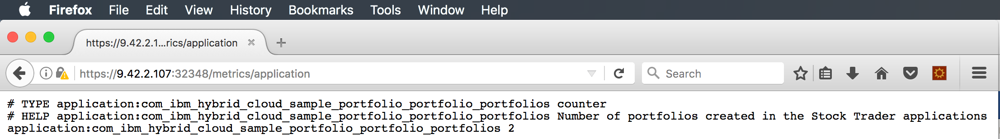

---

copyright:
  years: 2019
lastupdated: "2019-04-22"

keywords: mpmetrics microprofile, mpmetrics, prometheus java, metrics java, microprofile metrics

subcollection: java

---

{:new_window: target="_blank"}
{:shortdesc: .shortdesc}
{:screen: .screen}
{:codeblock: .codeblock}
{:pre: .pre}
{:tip: .tip}
{:note: .note}
{:important: .important}

# MicroProfile의 메트릭
{: #mp-metrics}

MicroProfile에서는 단순 어노테이션을 사용하여 애플리케이션에 사용자 정의 메트릭을 제공하는 메트릭 기능을 제공합니다. 이 기능을 사용하려면 `mpMetrics-1.1` 기능을 `server.xml`에 추가하십시오. 추가 앱 서버 특정 메트릭(예: JDBC 연결 풀에 관한 메트릭)을 보려면 선택적으로 `monitor-1.0` 기능을 추가할 수 있습니다.

`@Counted` 어노테이션을 가져와 간단한 카운터를 작성하십시오.

```java
import org.eclipse.microprofile.metrics.annotation.Counted;
```
{: codeblock}

그리고 나서 다음 예에 표시된 대로 `@Counted` 어노테이션을 사용하여 `createPortfoloio` 메소드가 호출된 횟수를 세는 단순 카운터를 작성하십시오. 

```java
@POST
@Path("/{owner}")
@Produces("application/json")
@Counted(monotonic=true, name="portfolios", displayName="Stock Trader portfolios", description="Number of portfolios created in the Stock Trader applications")
@RolesAllowed({"StockTrader"})
public JsonObject createPortfolio(@PathParam("owner") String owner) throws SQLException {
```
{: codeblock}

이 코드를 빌드하려면 다음 스탠자를 Maven의 `pom.xml` 파일에 추가하십시오.

```xml
<dependency>
  <groupId>org.eclipse.microprofile</groupId>
  <artifactId>microprofile</artifactId>
  <version>2.0.1</version>
  <type>pom</type>
  <scope>provided</scope>
</dependency>
```
{: codeblock}

이 스탠자가 있으면 `createPortfolio` JAX-RS 메소드를 호출할 때마다 카운터가 증분됩니다.  

`GET /metrics` URI를 호출하여 JVM(클래스 로딩, 힙 및 가비지 콜렉션 통계)과 애플리케이션 정의 메트릭을 둘 다 볼 수 있습니다. `GET /metrics/application` URI는 애플리케이션 정의 메트릭만 리턴합니다. 

지정된 포트(이 예제에서는 32388)를 사용하여 curl CLI를 통해 이 REST GET API에 액세스할 수 있습니다.

```
Johns-MacBook-Pro-8:StockTrader jalcorn$ curl http://9.42.2.107:32388/metrics/application

# TYPE application:com_ibm_hybrid_cloud_sample_portfolio_portfolio_portfolios counter

# HELP application:com_ibm_hybrid_cloud_sample_portfolio_portfolio_portfolios Number of portfolios created in the Stock Trader applications

application:com_ibm_hybrid_cloud_sample_portfolio_portfolio_portfolios

Johns-MacBook-Pro-8:StockTrader jalcorn$
```
{: screen}

두 개의 포트폴리오가 예상대로 계수되는 것을 확인할 수 있습니다. 

다음은 몇 가지 참고사항입니다.
- 이는 인메모리 카운터입니다. 팟(Pod)이 다시 시작되면 값이 0으로 재설정됩니다. 복제본이 여러 개인 경우 각각의 값은 고유합니다.
- "# HELP" 텍스트는 `@Counted` 어노테이션에 설명으로 지정한 내용입니다.

웹 브라우저에서도 이 REST GET 엔드포인트의 출력을 볼 수 있습니다.

{: caption="그림 1. REST GET 엔드포인트 웹 브라우저" caption-side="bottom"}

기본적으로 `/metrics` 엔드포인트에서는 https 및 로그인 인증 정보를 전달해야 합니다. Liberty 18.0.0.3에서는 http를 허용하고 인증되지 않도록 이 엔드포인트를 정의하기 위해 `server.xml`에 둘 수 있는 다음 스탠자를 소개합니다.

```xml
<mpMetrics authentication="false"/>
```

Prometheus 스크래퍼(scraper) 구성이 엔드포인트에 더 쉽게 액세스할 수 있도록 단순화되었습니다.
