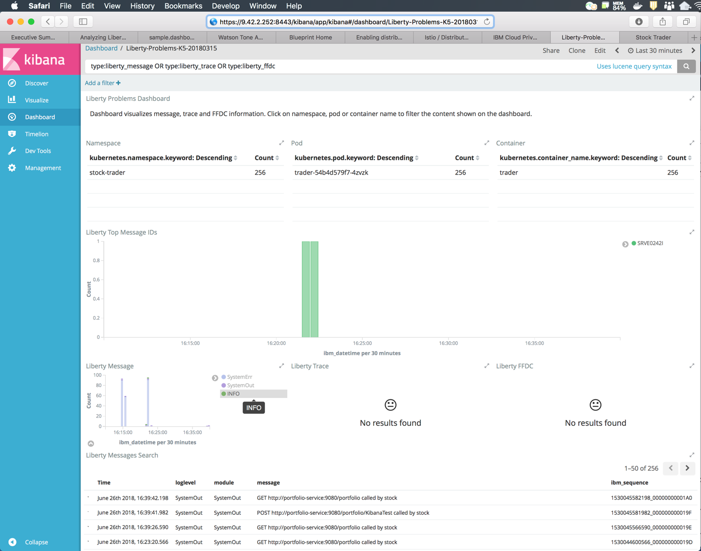

---

copyright:
  years: 2019
lastupdated: "2019-06-10"

keywords: java logging, log level java, debug java, json log java, json log help, kibana liberty, liberty messages

subcollection: java

---

{:new_window: target="_blank"}
{:shortdesc: .shortdesc}
{:screen: .screen}
{:codeblock: .codeblock}
{:pre: .pre}
{:tip: .tip}
{:note: .note}
{:important: .important}

# 日志记录
{: #mp-logging}

使用 MicroProfile 应用程序进行日志记录的建议方法是 Java&trade; JSR-47 日志记录标准。可以从以下 import 语句开始：

```java
import java.util.logging.Level;
import java.util.logging.Logger;
```
{: codeblock}

其次，在类级别对记录器的实例进行实例化：

```java
private static Logger logger = Logger.getLogger(PortfolioService.class.getName());
```
{: codeblock}

在代码中的操作前、操作后和操作内，添加对 `logger` 实例的调用。`Logger` 接口的方法本身会命名为指示所记录信息的重要性或“级别”。

```java
logger.info("Creating portfolio for "+owner);
logger.warning("Unable to send message to JMS provider. Continuing without notification of change in loyalty level.");
```
{: codeblock}

这些消息输出到控制台时，会显示日志级别。

```
[INFO] Creating portfolio for John

[WARNING] Unable to send message to JMS provider. Continuing without notification of change in loyalty level.
```
{: screen}

通过日志级别，可以灵活地动态选择应用程序写入的日志。通过使用日志级别，可以预先编写用于描述高级别应用程序状态和详细调试内容的日志代码。因此，您可以过滤掉更详细的调试内容，除非您需要这些内容。日志级别 `info` 通常是最低输出级别，之后的级别由低到高依次为 `fine`、`finer`、`finest` 和 `debug`。

如果日志条目需要多行代码或涉及字符串并置等大开销操作，请考虑使用测试来对其进行防护，以确定是否启用了日志级别。进行这样的检查是为了确保应用程序不会花费关键的时间来构建最终会被过滤掉的日志消息。在以下示例中，预期的日志级别 `fine` 在尝试构建消息输出之前就已启用。

```java
if (logger.isLoggable(Level.FINE)) {
    StringWriter writer = new StringWriter();
    exception.printStackTrace(new PrintWriter(writer));
    logger.fine(writer.toString());
}
```
{: codeblock}

有关日志级别和配置详细信息的更多信息，请参阅 [WebSphere Liberty 故障诊断指南](https://www.ibm.com/support/knowledgecenter/SSEQTP_liberty/com.ibm.websphere.wlp.doc/ae/rwlp_logging.html){: new_window}  和 [java.util.logging API 文档](https://docs.oracle.com/javase/8/docs/api/java/util/logging/package-summary.html){: new_window} 。

## 使用 Liberty 进行 JSON 日志记录
{: #mp-json-logging}

Liberty 支持 JSON 格式的日志记录。启用时，日志消息会以 JSON 格式写入控制台。使用 `server.xml` 中的以下 logging 节可启用此项：

```xml
<logging consoleLogLevel="INFO" consoleFormat="json" consoleSource="message,trace,accessLog,ffdc" />
```
{: codeblock}

虽然控制台源列表中包含 `accessLog`，但必须启用 HTTP 访问日志记录后，才能将这些日志写入控制台。以下片段说明了如何在 `server.xml` 中将 `accessLogging` 子元素添加到 `httpEndpoint` 元素：

```xml
<httpEndpoint id="defaultHttpEndpoint" host="\*" httpPort="9080" httpsPort="9443">
  <accessLogging
    filepath="${server.output.dir}/logs/http_defaultEndpoint_access.log"
    logFormat='%h %u %t "%r" %s %b %D %{User-agent}i'>
  </accessLogging>
</httpEndpoint>
```
{: codeblock}

现在，将以下代码添加到应用程序时：

```java
if (logger.isLoggable(Level.AUDIT)) {
    logger.audit("Initialization complete");
}
```

您可以在日志中看到以下输出：

```json
{ "type":"liberty_message",
  "host":"trader-54b4d579f7-4zvzk",
  "ibm_userDir":"\/opt\/ol\/wlp\/usr\/",
  "ibm_serverName":"defaultServer",
  "ibm_datetime":"2018-06-21T19:23:21.356+0000",
  "ibm_threadId":"00000028",
  "module":"com.trader.Main",
  "loglevel":"AUDIT",
  "message":"Initialization complete"}
```
{: codeblock}

### 读取 JSON 日志输出
{: #mp-json-log-output}

完整的 JSON 输出对于日志存储和搜索很有用，但要读取却并不容易。您可以在终端窗口中使用 `kubectl` 命令来检查日志的内容。幸好，有一个名为 `jq` 的命令行工具可提供帮助。

通过 `jq` 命令，您可以过滤掉不需要的字段，而只专注于所需的字段。如果要查看 `message` 字段，而过滤掉其他所有内容，请参阅以下示例：

```
kubectl logs trader-54b4d579f7-4zvzk -n stock-trader -c trader | grep message | jq .message -r
```
{: pre}

Liberty 具有一些非 JSON 格式的原始控制台消息。可以使用 `grep` 命令来确保 `jq` 专门解析包含消息字段的行。

## 其他功能
{: #mp-log-features}

使用日志级别的准则（例如，何时使用 `logger.info` 或 `logger.fine`）是每个组织或项目必须决定的。通常，这些接口在几乎任何项目中都是必需且有用的。

一个最佳做法是在 `server.xml` 文件的每个相关字段中使用环境变量（通过 Kubernetes 配置映射或私钥传递给 pod）。通过使用此方法，您可以更改日志记录配置，而无需重新构建和重新部署 Docker 映像。

例如，要使用环境变量来设置细颗粒度日志记录属性，可将先前示例中的以下节：

```xml
<logging consoleLogLevel="INFO" consoleFormat="json" consoleSource="message,trace,accessLog,ffdc" />
```
{: codeblock}

更改为以下条目：

```xml
<logging consoleLogLevel="${env.LOG_LEVEL}" consoleFormat="${env.LOG_FORMAT}" consoleSource="${env.LOG_SOURCE}" />
```
{: codeblock}

另一个替代方法是使用 `WLP_LOGGING_CONSOLE_FORMAT` 环境变量，如[日志记录和跟踪文档](https://www.ibm.com/support/knowledgecenter/SSEQTP_liberty/com.ibm.websphere.wlp.doc/ae/rwlp_logging.html){: new_window}  中所述。此方法类似于前一示例，您可以将 `WLP_LOGGING_CONSOLE_FORMAT` 变量设置为 `basic`（缺省值）或 `json`。

## Liberty 的 Kibana 仪表板
{: #liberty-kibana}

除了新的 JSON 日志记录功能，Liberty 还提供了[可从 GitHub 下载](https://www.ibm.com/support/knowledgecenter/en/SSEQTP_liberty/com.ibm.websphere.wlp.doc/ae/twlp_icp_json_logging.html){: new_window}  的预构建 Kibana 仪表板。请遵循链接中的指示信息进行安装。现在提供了两个新仪表板：


选择仪表板以进行问题确定时，可以看到：



此仪表板是交互式的。例如，如果在 **Liberty 消息**窗口小部件的图注中选择 **INFO**，**Liberty 消息搜索**窗口小部件会自行进行过滤，以仅显示 `loglevel=INFO` 的消息。此仪表板会联合所有基于 Liberty 的微服务中的日志数据，并过滤掉其他系统日志。

还有与 Liberty Helm 图表关联的更多 Kibana 和 Grafana 仪表板。这些仪表板作为 [Liberty Cloud `pak` 的扩展](https://github.com/IBM/charts/tree/master/stable/ibm-websphere-liberty/ibm_cloud_pak/pak_extensions/dashboards){: new_window}  提供。

## 后续步骤
{: #mp-logging-next-steps notoc}

有关使用附加器、日志级别和配置详细信息来定制日志消息的更多信息，请参阅官方的 [Spring Boot 日志记录参考指南](https://docs.spring.io/spring-boot/docs/current/reference/html/howto-logging.html){: new_window} 。

了解有关查看以下每个部署环境中日志的更多信息：

* [Kubernetes 日志](https://kubernetes.io/docs/concepts/cluster-administration/logging/){: new_window} 
* [{{site.data.keyword.openwhisk}} 日志和监视](/docs/openwhisk?topic=cloud-functions-logs)
* [{{site.data.keyword.cloud_notm}} Log Analysis](/docs/services/CloudLogAnalysis?topic=cloudloganalysis-log_analysis_ov#log_analysis_ov)
* [{{site.data.keyword.cloud_notm}} Private ELK 堆栈](https://www.ibm.com/support/knowledgecenter/en/SSBS6K_2.1.0.2/manage_metrics/logging_elk.html){: new_window} 
